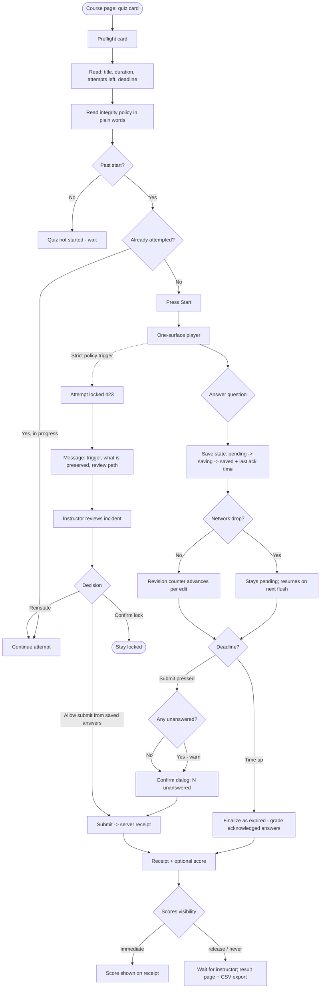
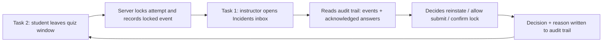

# Lab 5 — User Flow Diagrams

Two flows, one per task. Drawn as Mermaid `flowchart TD` graphs (renders on GitHub, VS Code,
and mermaid.live). Solid arrows = happy path; the `?` labelled merges are optional branches the
evaluator can take during the demo.

---

## Task 1 — Instructor publishes an integrity-protected quiz

```mermaid
flowchart TD
    A([Dashboard: course opens]) --> B[Press "New quiz"]
    B --> C[Editor: title + instructions]
    C --> D[Add questions]
    D --> D1{Question type?}
    D1 -->|single / multiple| D2[Type options + mark correct one]
    D1 -->|numeric| D3[Expected value + tolerance]
    D1 -->|short| D4[Accepted answer, case-insensitive]
    D2 --> E[Configure settings]
    D3 --> E
    D4 --> E
    E --> E1[Duration limit]
    E --> E2[Attempts allowed]
    E --> E3[Scores: immediate / release / never]
    E --> E4[Integrity policy: Off / Warn / Strict + plain-language note]
    E1 --> F[Preview exactly as a student sees it]
    E2 --> F
    E3 --> F
    E4 --> F
    F --> F1{Everything correct?}
    F1 -->|No - tweak| C
    F1 -->|Yes| G[Publish]
    G --> G1{Version is frozen}
    G1 -->|Edit later| H[Clone into new draft version]
    G1 -->|Done| I([Published card: vN badge + preflight link live])
    H --> C
```

### Annotations

- `F` (preview) is the same React player component the student uses — nothing special "for staff" exists.
- `G → G1` is enforced by the server (published versions are immutable; edits route to a cloned draft).
- `H` demos the G4 guarantee: a live quiz can never be mutated mid-run.

---

## Task 2 — Student completes and submits a quiz



### Reads for the evaluator

- `G` — question + answer on one surface (G1).
- `I / I2` — the G2 save-state story including the network-drop branch.
- `J1` — deadline policy: the server finalizes as soon as time is up; late saves/submits are not silently accepted.
- `O → O3` — the G3 loop: the lock is *explained*, review decisions are recorded with reasons, and re-entry is possible.
- `K2 / K3` — honouring the configured `show_scores` policy.

---

## Cross-task connection

Completing Task 2 with the strict policy tripped creates the incident that Task 1's instructor
resolves in the "variants worth demoing" step:

