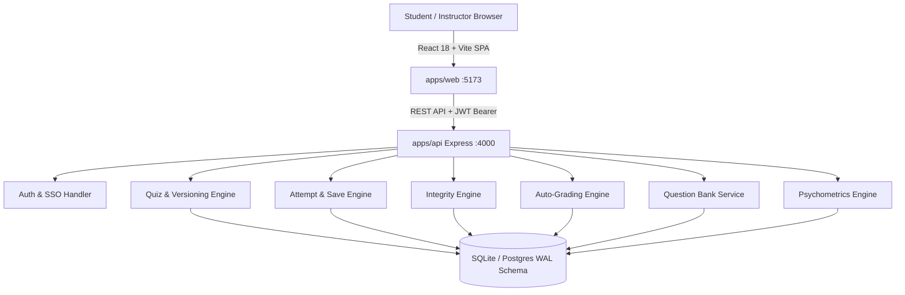

# Labs 10–12: RELEASE — Complete System Manual & Architecture

Interval is a complete, production-ready quiz portal for the sAIDE platform at IIT Ropar. It delivers an end-to-end assessment experience with high reliability, fair integrity enforcement, rich STEM math rendering, and psychometric analytics.

---

## 1. System Architecture



---

## 2. API Endpoints Specification

### Authentication & Memberships
- `POST /api/auth/register` — Create student or instructor account.
- `POST /api/auth/login` — Sign in and receive JWT token.
- `POST /api/auth/sso` — Campus CAS / sAIDE SSO seamless authentication.
- `GET /api/courses` — List enrolled courses with viewer's role.
- `POST /api/courses` — Create a new course (instructor/admin).
- `PUT /api/courses/:id/members` — Add member with role (student, TA, instructor).

### Quiz Authoring & Versioning
- `GET /api/quizzes/course/:courseId` — List published and draft quizzes.
- `POST /api/quizzes/course/:courseId` — Create new quiz draft.
- `GET /api/quizzes/:id` — View quiz versions, settings, and questions.
- `PUT /api/quizzes/:id` — Update draft settings (time, policy, scoring, shuffle).
- `PATCH /api/quizzes/:id/publish` — Freeze version as published and live.
- `POST /api/quizzes/:id/clone` — Clone published version into a new editable draft.
- `POST /api/quizzes/:id/draft/questions` — Add question (single, multiple, numeric, short).
- `PUT /api/quizzes/:id/draft/questions/:qid` — Edit question in draft.
- `DELETE /api/quizzes/:id/draft/questions/:qid` — Delete question from draft.

### Question Banks & Batch Import/Export
- `GET /api/banks/course/:courseId` — List question banks for course.
- `POST /api/banks/course/:courseId` — Create a new question bank.
- `GET /api/banks/:id` — Get bank details with all questions.
- `POST /api/banks/:id/questions` — Add tagged question to bank.
- `POST /api/banks/:id/import` — Batch JSON/CSV question import.
- `DELETE /api/banks/:id/questions/:qid` — Remove question from bank.

### Student Accommodations
- `GET /api/accommodations/course/:courseId` — List student accommodations.
- `POST /api/accommodations/course/:courseId` — Set student time multiplier (e.g. 1.5x) and extra minutes.
- `DELETE /api/accommodations/course/:courseId/user/:userId` — Remove accommodation.

### Attempt Lifecycle & Policy
- `POST /api/attempts/start` — Start/resume attempt with server deadline calculation.
- `GET /api/attempts/:id` — View attempt state, questions, and acknowledged answers.
- `PUT /api/attempts/:id/answers` — Save batch answers with revision reconciliation.
- `POST /api/attempts/:id/policy` — Record client focus/visibility events.
- `POST /api/attempts/:id/submit` — Submit attempt and trigger auto-grading.

### Results, Review & Analytics
- `GET /api/results/my` — Student view of all released results.
- `GET /api/results/attempt/:id` — Detailed question breakdown and answers.
- `POST /api/results/quiz/:versionId/release` — Release scores and answer keys.
- `GET /api/review/incidents` — Instructor incident inbox for locked attempts.
- `POST /api/review/decisions` — Record review decision (reinstate or grade from saved).
- `GET /api/analytics/version/:versionId` — Score distributions and item psychometrics.

---

## 3. Deployment & Quickstart

```bash
# 1. Install dependencies
npm install

# 2. Re-seed database with demo courses, users, and quizzes
npm run seed

# 3. Run automated test suite
npm test

# 4. Build production bundle
npm run build

# 5. Start with Docker Compose
docker compose up -d
```
